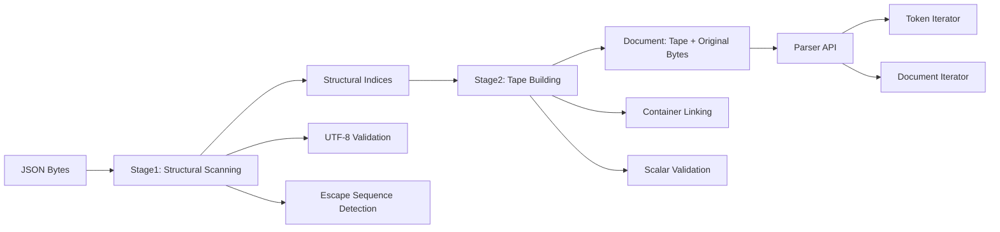
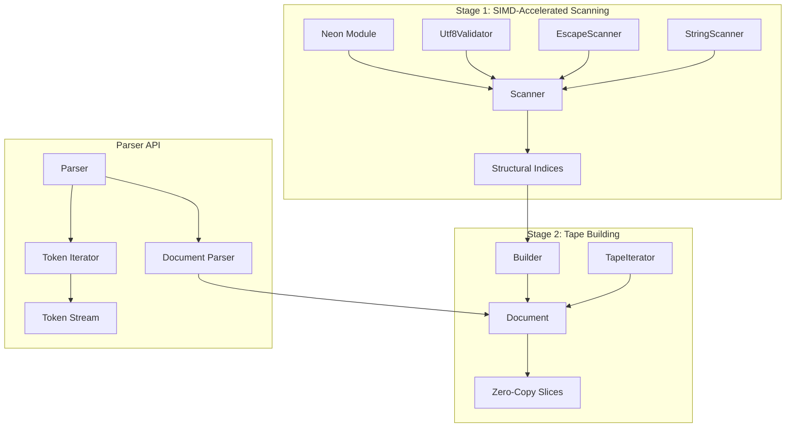
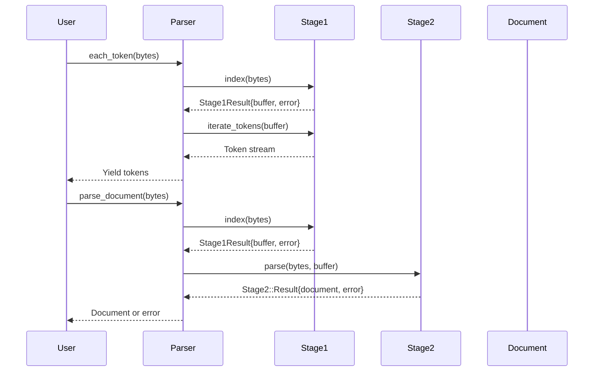

# simdjson (Crystal)

ARM64-focused JSON parsing scaffolding for Apple Silicon (M-series).

This project provides:
- A zero-copy, slice-based token iterator in Crystal.
- SIMD-accelerated stage1 on AArch64 via NEON

## Architecture Overview

simdjson follows a two-stage parsing pipeline optimized for performance while maintaining zero-copy semantics.

### Stage 1: Lexer (Structural Scanning)
**Purpose**: Acts as a high-performance lexer that identifies all structural JSON tokens.

**What it does**:
- Scans input bytes to locate structural characters (`{`, `}`, `[`, `]`, `:`, `,`)
- Performs UTF-8 validation and escape sequence detection
- Produces structural indices (positions of all structural tokens)
- Uses SIMD acceleration (NEON on ARM64) for maximum performance

**Output**: Array of byte positions pointing to structural tokens in the original JSON

### Stage 2: Parser (Tape Building)
**Purpose**: Acts as a traditional parser that builds a structured representation from the lexer's output.

**What it does**:
- Consumes structural indices from Stage 1
- Builds a compact "tape" representation with typed entries
- Links containers (objects/arrays) with their contents
- Validates JSON syntax and structure

**Output**: Compact tape with typed entries for efficient traversal

### High-Level Data Flow



### Component Architecture



## Build

Build the Crystal side:

```
crystal build bin/bench.cr
```

Run the benchmark (`--release` for higher throughput):

```
./bin/bench [options] <json file> [json file...]
```
Options:
- `--release`: re-run with `crystal --release` (this is the default behavior).
- `--profile`: report stage1/stage2 timings (runs both stages). When passed, `bin/bench` will attempt to enable compile-time LLVM instrumentation and set `LLVM_PROFILE_FILE=bench-%p.profraw` so an `.profraw` file is generated; processing requires `llvm-profdata`/`llvm-cov` (toolchain support may be needed).

  Example workflow (when instrumentation succeeds):

  ```bash
  ./bin/bench --profile data.json
  # produces bench-<pid>.profraw
  llvm-profdata merge -o bench.profdata bench-*.profraw
  llvm-cov show ./bin/bench -instr-profile=bench.profdata
  ```

Multiple files are parsed in parallel automatically.

Note: the CLI no longer displays an interactive progress bar during parallel runs to avoid contention; use `--verbose` to print worker and system allocation details.

Example:

```
./bin/bench --release ~/Downloads/twitter.json big.json big2.json
```

## Coverage

Crystal 1.19 does not expose built-in coverage in `crystal spec`. Use kcov:

```
./scripts/coverage_kcov
```


## Newline Handling

The parser supports comprehensive newline handling for all common line ending formats:

- **LF** (`\n`) - Unix/Linux line endings
- **CR** (`\r`) - Classic Mac OS line endings
- **CRLF** (`\r\n`) - Windows/DOS line endings

All newline types are detected as `TokenType::Newline` tokens during parsing. When a CRLF sequence is encountered, it is treated as a single newline token with length 2.

```crystal
require "./src/simdjson"

# All newline types are properly detected
parser = Simdjson::Parser.new

# LF newline
lf_json = "123\n456".to_slice
parser.each_token(lf_json) do |token|
  if token.type == TokenType::Newline
    puts "Found LF newline at position #{token.start}"
  end
end

# CR newline
cr_json = "123\r456".to_slice
parser.each_token(cr_json) do |token|
  if token.type == TokenType::Newline
    puts "Found CR newline at position #{token.start}"
  end
end

# CRLF newline
crlf_json = "123\r\n456".to_slice
parser.each_token(crlf_json) do |token|
  if token.type == TokenType::Newline
    puts "Found CRLF newline at position #{token.start}, length #{token.length}"
  end
end
```

## Usage

```crystal
require "./src/simdjson"

bytes = File.read("data.json").to_slice
parser = Simdjson::Parser.new
parser.each_token(bytes) do |tok|
  # tok.type, tok.start, tok.length
  # tok.slice(bytes) returns a zero-copy slice
end

doc_result = parser.parse_document(bytes, validate_literals: true, validate_numbers: true)
if doc_result.error.success?
  doc = doc_result.doc
  iter = doc.not_nil!.iterator
  iter.each do |entry|
    # entry.type and iter.slice(entry) for zero-copy access
  end
end
```

Notes:
- The current Crystal parser is a zero-copy token iterator. It does not build a DOM.
- String values are returned as raw JSON slices (quotes stripped) without unescaping.
- Stage1 uses Crystal NEON asm on AArch64 with a scalar fallback for non-AArch64 builds.
- UTF-8 is validated during stage1; set `SIMDJSON_VERIFY_NEON=1` to cross-check SIMD masks with scalar for debugging (slower).
- Stage2 builds a zero-copy tape without unescaping or number conversion.
- Literal/number validation is optional and can be enabled per-parse without copying.

## Components and Interoperability

### Stage 1: SIMD-Accelerated Structural Scanning

**Purpose**: Locate structural JSON characters and perform UTF-8 validation.

**Key Components**:
- **Neon Module**: ARM64 SIMD implementation using NEON intrinsics for 8-byte mask scanning
- **Scanner**: Orchestrates string, escape, and character scanning
- **Utf8Validator**: Stateful UTF-8 validation across block boundaries
- **EscapeScanner**: Detects escape sequences in strings
- **StringScanner**: Tracks string boundaries and quote states

**Output**: `Array(UInt32)` of structural indices pointing to JSON structural characters.

**Interoperability**: Stage1 produces the `Stage1Buffer` that Stage2 consumes. The buffer contains:
```crystal
struct Stage1Buffer
  ptr : Pointer(UInt32)  # Pointer to structural indices
  count : Int32         # Number of indices
  backing : Array(UInt32)? # Optional ownership of the array
end
```

### Stage 2: Tape Building and Document Representation

**Purpose**: Convert structural indices into a compact tape representation for efficient traversal.

**Key Components**:
- **Builder**: Incrementally constructs the tape from structural indices
- **Document**: Wraps original bytes + tape for zero-copy access
- **TapeIterator**: Provides sequential access to tape entries
- **Entry**: Individual tape entries with type and offset/length information

**Tape Structure**:
```crystal
struct Entry
  type : TapeType  # StartObject, EndObject, String, Number, etc.
  a : Int32       # Start offset or count
  b : Int32       # Length or end index
end
```

**Interoperability**: Stage2 consumes `Stage1Buffer` and produces `Stage2::Document`:
```crystal
def self.parse(bytes : Bytes, buffer : Stage1Buffer, max_depth : Int32) : Stage2::Result
```

### Parser: High-Level API

**Purpose**: Provides convenient front-end to the two-stage pipeline.

**Key Methods**:
- `each_token(bytes, &block)` - Iterate tokens with zero-copy slices
- `parse_document(bytes, validate_literals, validate_numbers)` - Build complete document

**Error Handling**: Returns `ErrorCode` enums for various failure modes (UTF-8 errors, unclosed strings, etc.)

### Data Flow and Interoperability



### Zero-Copy Design

All components maintain references to the original `Bytes` buffer:
- **No data copying**: All slices reference original memory
- **No string unescaping**: Raw JSON preserved
- **No number conversion**: Numbers stored as byte ranges
- **Minimal memory allocation**: Only metadata structures allocated

### Performance Characteristics

- **Stage1**: SIMD-accelerated on ARM64, scalar fallback elsewhere
- **Stage2**: Linear scan through structural indices
- **Memory**: O(structural_count) metadata, O(1) per token access
- **Cache**: Good locality due to sequential processing

## Current Limitations and Implementation Suggestions

### 1. No UTF-8 Normalization

**Current State**: Stage1 only validates UTF-8, doesn't normalize it.

**Architectural Decision**: UTF-8 normalization should be handled in **Stage 2**, not Stage 1, for these reasons:

1. **Performance**: Stage 1 is optimized for speed with SIMD acceleration. Adding normalization would slow down the critical path
2. **Separation of Concerns**: Stage 1 should focus on structural scanning and validation, not text processing
3. **Optional Feature**: Normalization should be opt-in, not mandatory for all parsing operations
4. **Memory Efficiency**: Normalization can be done lazily in Stage 2 when strings are actually accessed

**Suggested Implementation**:
```crystal
# Add to Stage2::Builder
def normalize_utf8(slice : Bytes) : Bytes
  # Implement NFC/NFD normalization
  # Could use external library or implement algorithm
end

# Modify string_entry in Stage2::Builder
def string_entry(start_index : Int32, type : TapeType, next_struct : Int32) : ErrorCode
  end_index = Stage2.scan_string_end(@bytes, start_index + 1, next_struct)
  return ErrorCode::UnclosedString if end_index < 0

  raw_slice = @bytes[start_index + 1, end_index - (start_index + 1)]
  normalized_slice = normalize_utf8(raw_slice)  # New normalization step

  @tape << Entry.new(type, normalized_slice.to_unsafe, normalized_slice.size)
  ErrorCode::Success
end
```

**Location**: Implement in `src/simdjson/stage2.cr` in the `Builder` class.

### 2. No String Unescaping

**Current State**: String values are raw JSON slices with quotes stripped but not unescaped.

**Suggested Implementation**:
```crystal
# Add to Stage2::Builder
def unescape_string(escaped_slice : Bytes) : Bytes
  result = Bytes.new(escaped_slice.size) # Conservative allocation
  src = escaped_slice.to_unsafe
  dst = result.to_unsafe
  i = 0
  j = 0
  
  while i < escaped_slice.size
    c = src[i]
    if c == '\\'.ord && i + 1 < escaped_slice.size
      case src[i + 1]
      when '"'.ord; dst[j] = '"'.ord; i += 1
      when '\\'.ord; dst[j] = '\\'.ord; i += 1
      when '/'.ord; dst[j] = '/'.ord; i += 1
      when 'b'.ord; dst[j] = '\b'.ord; i += 1
      when 'f'.ord; dst[j] = '\f'.ord; i += 1
      when 'n'.ord; dst[j] = '\n'.ord; i += 1
      when 'r'.ord; dst[j] = '\r'.ord; i += 1
      when 't'.ord; dst[j] = '\t'.ord; i += 1
      when 'u'.ord
        # Handle Unicode escapes \uXXXX
        if i + 5 < escaped_slice.size
          codepoint = parse_unicode_escape(src + i + 2)
          j += write_utf8_codepoint(dst + j, codepoint)
          i += 5
        end
      else
        dst[j] = c
      end
    else
      dst[j] = c
    end
    i += 1
    j += 1
  end
  
  result[0, j] # Return actual used portion
end
```

**Location**: Add to `src/simdjson/stage2.cr` and modify `string_entry` method.

### 3. No Character Set Conversion

**Current State**: UTF-8 is validated but not converted to other encodings.

**Suggested Implementation**:
```crystal
# Add conversion module
module Simdjson::Conversion
  def self.to_utf16(utf8_slice : Bytes) : Bytes
    # Convert UTF-8 to UTF-16
    # Could use external library or implement conversion
  end

  def self.to_utf32(utf8_slice : Bytes) : Bytes
    # Convert UTF-8 to UTF-32
  end
end

# Add to Document for on-demand conversion
class Document
  def string_as_utf16(entry : Stage2::Entry) : Bytes?
    slice = self.slice(entry)
    return nil unless slice
    Simdjson::Conversion.to_utf16(slice)
  end
end
```

**Location**: Create new file `src/simdjson/conversion.cr` and extend `Document` class.

### Implementation Strategy

1. **Start with string unescaping** - Most commonly needed feature
2. **Add UTF-8 normalization** - Important for text processing
3. **Implement character set conversion** - For interoperability needs

**Performance Considerations**:
- Make features optional via parser flags
- Cache converted results when possible
- Use zero-copy when feasible (e.g., ASCII strings don't need conversion)
- Consider lazy evaluation for expensive operations

**API Design**:
```crystal
# Extended parser options
parser.parse_document(bytes,
  validate_literals: true,
  validate_numbers: true,
  unescape_strings: true,      # New option
  normalize_utf8: true,        # New option
  target_encoding: :utf16      # New option
)
```

## Usage Examples and Patterns

### Basic Token Iteration

```crystal
require "./src/simdjson"

# Read JSON file
bytes = File.read("data.json").to_slice
parser = Simdjson::Parser.new

# Iterate all tokens
parser.each_token(bytes) do |token|
  case token.type
  when TokenType::String
    puts "String: #{token.slice(bytes).to_s}"
  when TokenType::Number
    puts "Number: #{token.slice(bytes).to_s}"
  when TokenType::True, TokenType::False, TokenType::Null
    puts "Literal: #{token.slice(bytes).to_s}"
  when TokenType::StartObject
    puts "Start Object"
  when TokenType::EndObject
    puts "End Object"
  when TokenType::StartArray
    puts "Start Array"
  when TokenType::EndArray
    puts "End Array"
  end
end
```

### Document Parsing and Traversal

```crystal
# Parse complete document
result = parser.parse_document(bytes, validate_literals: true, validate_numbers: true)

if result.error.success?
  doc = result.doc.not_nil!

  # Iterate through document tape
  doc.each_entry do |entry|
    case entry.type
    when Stage2::TapeType::String, Stage2::TapeType::Key
      slice = doc.slice(entry)
      puts "String: #{slice.to_s if slice}" if slice
    when Stage2::TapeType::Number
      slice = doc.slice(entry)
      puts "Number: #{slice.to_s if slice}" if slice
    when Stage2::TapeType::True
      puts "Boolean: true"
    when Stage2::TapeType::False
      puts "Boolean: false"
    when Stage2::TapeType::Null
      puts "Null value"
    when Stage2::TapeType::StartObject
      puts "Start Object (count: #{entry.a})"
    when Stage2::TapeType::EndObject
      puts "End Object"
    when Stage2::TapeType::StartArray
      puts "Start Array (count: #{entry.a})"
    when Stage2::TapeType::EndArray
      puts "End Array"
    end
  end
else
  puts "Parse error: #{result.error}"
end
```

### Error Handling Patterns

```crystal
def safe_parse_document(bytes : Bytes)
  result = parser.parse_document(bytes, validate_literals: true, validate_numbers: true)

  case result.error
  when ErrorCode::Success
    {result.doc, nil}
  when ErrorCode::Utf8Error
    {nil, "Invalid UTF-8 sequence detected"}
  when ErrorCode::UnclosedString
    {nil, "String not properly closed"}
  when ErrorCode::TapeError
    {nil, "Invalid JSON structure"}
  when ErrorCode::NumberError
    {nil, "Invalid number format"}
  when ErrorCode::DepthError
    {nil, "JSON nesting exceeds maximum depth"}
  else
    {nil, "Parse error: #{result.error}"}
  end
end

# Usage
doc, error = safe_parse_document(bytes)
if error
  puts "Error: #{error}"
else
  # Process document
  doc.not_nil!.each_entry do |entry|
    # ... process entries
  end
end
```

### Performance Optimization Patterns

```crystal
# Reuse parser instance for multiple files
parser = Simdjson::Parser.new(max_depth: 512)

# Process multiple files efficiently
files = ["file1.json", "file2.json", "file3.json"]
files.each do |filename|
  bytes = File.read(filename).to_slice

  # Use token iteration for streaming processing
  parser.each_token(bytes) do |token|
    # Process tokens without building full document
    process_token(token, bytes)
  end

  # Or build document for random access
  result = parser.parse_document(bytes, validate_literals: false)
  if result.error.success?
    process_document(result.doc.not_nil!)
  end
end

# For large files, consider memory mapping
def process_large_file(filename : String)
  File.open(filename, "r") do |file|
    # Memory map for large files
    bytes = file.read.to_slice

    # Process in chunks if needed
    chunk_size = 1024 * 1024 # 1MB chunks
    offset = 0

    while offset < bytes.size
      chunk_end = [offset + chunk_size, bytes.size].min
      chunk = bytes[offset, chunk_end - offset]

      parser.each_token(chunk) do |token|
        # Process chunk tokens
      end

      offset = chunk_end
    end
  end
end
```

### Custom Validation and Processing

```crystal
class JsonValidator
  def initialize(@parser : Simdjson::Parser)
  end

  def validate_schema(bytes : Bytes, schema : Hash(String, Symbol))
    result = @parser.parse_document(bytes, validate_literals: true, validate_numbers: true)
    return false unless result.error.success?

    doc = result.doc.not_nil!
    validate_object(doc.iterator, schema)
  end

  private def validate_object(iter : Stage2::TapeIterator, schema : Hash(String, Symbol)) : Bool
    entry = iter.next_entry
    return false unless entry && entry.type == Stage2::TapeType::StartObject

    while true
      key_entry = iter.next_entry
      break unless key_entry

      case key_entry.type
      when Stage2::TapeType::Key
        key_slice = iter.slice(key_entry)
        next unless key_slice
        key = key_slice.to_s

        expected_type = schema[key]
        value_entry = iter.next_entry
        return false unless value_entry

        case expected_type
        when :string
          return false unless value_entry.type == Stage2::TapeType::String
        when :number
          return false unless value_entry.type == Stage2::TapeType::Number
        when :boolean
          return false unless [Stage2::TapeType::True, Stage2::TapeType::False].includes?(value_entry.type)
        when :object
          return false unless value_entry.type == Stage2::TapeType::StartObject
          # Recursively validate nested object
        when :array
          return false unless value_entry.type == Stage2::TapeType::StartArray
        end

      when Stage2::TapeType::EndObject
        return true

      else
        return false
      end
    end

    false
  end
end
```

### Integration with Crystal Web Frameworks

```crystal
# Example with Kemal framework
require "kemal"
require "./src/simdjson"

parser = Simdjson::Parser.new

post "/api/process" do |env|
  body = env.request.body.not_nil!.gets_to_end
  bytes = body.to_slice

  result = parser.parse_document(bytes, validate_literals: true, validate_numbers: true)

  if result.error.success?
    doc = result.doc.not_nil!

    # Process document
    response_data = process_json_document(doc)

    env.response.content_type = "application/json"
    response_data.to_json
  else
    env.response.status_code = 400
    {"error": "Invalid JSON: #{result.error}"}.to_json
  end
end

def process_json_document(doc : Stage2::Document)
  # Extract specific fields
  iterator = doc.iterator
  result = {} of String => String

  while entry = iterator.next_entry
    if entry.type == Stage2::TapeType::Key
      key_slice = iterator.slice(entry)
      next unless key_slice
      key = key_slice.to_s

      value_entry = iterator.next_entry
      next unless value_entry

      case value_entry.type
      when Stage2::TapeType::String
        value_slice = iterator.slice(value_entry)
        result[key] = value_slice.to_s if value_slice
      when Stage2::TapeType::Number
        value_slice = iterator.slice(value_entry)
        result[key] = value_slice.to_s if value_slice
      end
    end
  end

  result
end
```

### Memory Management Best Practices

```crystal
# Efficient memory usage patterns

# 1. Reuse parser instances
parser = Simdjson::Parser.new

# 2. Process files in batches to avoid memory pressure
def process_files_batch(filenames : Array(String), batch_size : Int32 = 10)
  filenames.each_slice(batch_size) do |batch|
    batch_results = batch.map do |filename|
      bytes = File.read(filename).to_slice
      result = parser.parse_document(bytes)
      {filename, result}
    end

    # Process batch results
    process_batch(batch_results)

    # Explicitly clear references to allow GC
    batch_results.clear
  end
end

# 3. Use token iteration for streaming when full document not needed
def stream_process_large_file(filename : String)
  File.open(filename, "r") do |file|
    bytes = file.read.to_slice

    # Token iteration uses less memory than document parsing
    parser.each_token(bytes) do |token|
      case token.type
      when TokenType::String
        # Process string without building document
        process_string_token(token, bytes)
      when TokenType::Number
        # Process number token
        process_number_token(token, bytes)
      end
    end
  end
end

# 4. Handle large arrays efficiently
def process_large_array(bytes : Bytes)
  result = parser.parse_document(bytes)
  return unless result.error.success?

  doc = result.doc.not_nil!
  iterator = doc.iterator

  entry = iterator.next_entry
  return unless entry && entry.type == Stage2::TapeType::StartArray

  # Process array elements one by one
  while true
    element_entry = iterator.next_entry
    break unless element_entry

    case element_entry.type
    when Stage2::TapeType::EndArray
      break
    when Stage2::TapeType::String
      slice = iterator.slice(element_entry)
      process_array_element(slice.to_s) if slice
    when Stage2::TapeType::Number
      slice = iterator.slice(element_entry)
      process_array_element(slice.to_s) if slice
    end
  end
end
```

Limitations:
- No string unescape yet.
- No DOM builder yet; you get a token stream based on structural indexes.
