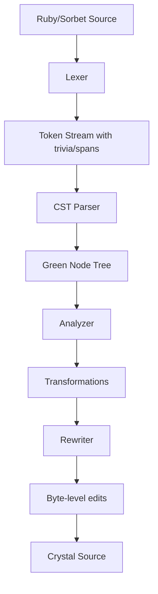

# Transpiler Improvements: CST-Based Analysis

## Overview

The Warp transpiler now uses **Concrete Syntax Tree (CST)-based analysis** instead of regex post-processing for handling complex Ruby/Sorbet to Crystal transformations. This approach provides:

- **Correct handling of whitespace and formatting** - preserves original code structure
- **Token-aware transformations** - understands context (token kinds, positions, trivia)
- **No regex side effects** - eliminates fragile pattern-matching issues
- **Scalable design** - easy to add new transformations without breaking existing ones

## Architecture

### CST Pipeline



### Key Components

#### 1. Analyzer

The analyzer scans the token stream and CST to identify transformation targets:

- **analyze_type_aliases()** - Identifies `T.type_alias { ... }` blocks and converts to Crystal `alias` syntax
- **analyze_main_guard()** - Removes `if __FILE__ == $PROGRAM_NAME` guards (uses `next_non_trivia_index()` to skip whitespace)
- **analyze_attr_reader()** - Converts Ruby `attr_reader :name` DSL to Crystal getters
- **analyze_symbol_literals()** - Transforms Sorbet symbols to Crystal equivalents
- **analyze_rescue_clauses()** - Converts rescue syntax for Crystal compatibility

#### 2. Rewriter

Applies transformations as byte-level edits:

```crystal
case transform.kind
when TransformKind::RemoveCast
  if replacement
    rewriter.replace(start, end_pos, replacement)
  else
    rewriter.remove(start, end_pos)
  end
end
```

#### 3. CST Transpiler

Orchestrates the full pipeline and optional post-processing:

```crystal
tokens, lex_error = Lexer.scan(@bytes)
cst, parse_error = CST::Parser.parse(@bytes, tokens)
analyzer = Analyzer.new(@bytes, tokens, cst, @target_lang, @config)
transformations = analyzer.analyze
rewriter = Rewriter.new(@bytes, tokens)
output = convert_single_quoted_to_double_quoted(rewriter.emit)
```

## Transformation Patterns

### Type Aliases

**Input (Ruby/Sorbet):**

```ruby
JsonType = T.type_alias { T.any(String, Integer, Float, T::Boolean, NilClass) }
```

**Output (Crystal):**

```crystal
alias JsonType = String | Int32 | Float64 | Bool | Nil
```

**Implementation:** Token-by-token matching to find `name = T.type_alias { ... }` pattern, extract inner content, convert types, and replace entire span.

### Main Guard Removal

**Input:**

```ruby
SorbetExamples.main if __FILE__ == $PROGRAM_NAME
```

**Output:**

```crystal
# Removed entirely (Crystal doesn't support global $PROGRAM_NAME)
```

**Implementation:**

- Uses `next_non_trivia_index()` to skip whitespace/newlines between tokens
- Matches pattern: `receiver . main if __FILE__ == ($ 0 | $PROGRAM_NAME)`
- Removes entire span without replacement

### Type Conversions

Handled by `SorbetParser.convert_type_str()`:

| Sorbet | Crystal |
| --- | --- |
| `Integer` | `Int32` |
| `T::Boolean` | `Bool` |
| `T::Array[T]` | `Array(T)` |
| `T::Hash[K,V]` | `Hash(K, V)` |
| `T.any(A, B)` | `A \| B` |
| `T.nilable(T)` | `T?` |
| `T.untyped` | `Object` (or `T` in generic context) |

## Key Improvements vs. Regex Approach

### Problem: Whitespace Sensitivity

**Regex Approach:**

```crystal
result.gsub(/^(\s*)(\w+)\s*=\s*(Union|Array|Hash|Set)/, "\\1alias \\2 = \\3")
```

Issues:

- Multiline whitespace breaks matching
- Indentation lost during replacement
- Cannot handle complex nested structures

**CST Approach:**

```crystal
j = next_non_trivia_index(idx + 1)
if j >= 0 && @tokens[j].kind == TokenKind::Dot
  # Continue matching...
end
```

Benefits:

- Whitespace and newlines are separate tokens - never lost
- Token positions are exact byte offsets
- Can match patterns across multiple lines naturally

### Problem: Context Sensitivity

**Regex Approach:**

```crystal
result.gsub(/T\.any\(([^)]+)\)/, "Union(\\1)")
```

Issues:

- Cannot distinguish `T.any()` in sig from `T.any()` in type annotation
- Breaks with nested parentheses: `T.any(Proc(...), String)`

**CST Approach:**

```crystal
if in_sig_block.call(start_pos, end_pos)
  # Skip transformation in sig blocks
else
  # Apply transformation in type contexts
end
```

Benefits:

- Context-aware via lambda/proc predicates
- Nested structures handled via proper brace/paren counting
- Transformations applied only where semantically correct

## Configuration

Type mappings are defined in `warp.yaml`:

```yaml
type_mapping:
  crystal:
    Integer: Int32
    Symbol: Symbol
    T::Boolean: Bool
    T::Nil: Nil
```

Custom mappings can be added per-project without modifying code.

## Testing

Integration tests verify the full pipeline:

```bash
crystal spec spec/integration/sorbet_transpiler_integration_test.cr
```

**Coverage:**

- ✓ Sig block removal and method signature generation
- ✓ T.let transformations (with type conversions)
- ✓ Type aliases (T.type_alias)
- ✓ Main guard removal
- ✓ Rescue clause conversion
- ✓ Complex nested structures

**Example test:**

```crystal
it "removes sig blocks completely without leaving fragments" do
  input = <<-RUBY
  class MyClass
    extend T::Generic
    sig { params(val: T.untyped).void }
    def initialize(val)
      @val = val
    end
  end
  RUBY

  result = transpile(input)
  result.should contain("def initialize(val : T) : Nil")
end
```

## Future Enhancements

1. **Visitor pattern for CST traversal** - Make complex tree walks more ergonomic
2. **Incremental analysis** - Cache and reuse results for large files
3. **Language plugin system** - Support more source/target language pairs
4. **Better error messages** - Point to exact token positions for debugging
5. **Custom analyzer registry** - Allow user-defined transformations

## Migration from Regex

If you have existing regex-based transformations, consider:

1. **Identify the pattern** - What Ruby construct does it target?
2. **Write token matcher** - Use `next_non_trivia_index()` to navigate
3. **Extract content** - Use token positions and `@source.byte_slice()`
4. **Create transformation** - Add to analyzer and use rewriter

Example migration:

```crystal
# Before (regex):
result.gsub(/\.freeze\b/, "")

# After (CST):
# In analyze_literal_and_runtime_cleanups:
if token.kind == TokenKind::Dot && next_tok.kind == TokenKind::Identifier && token_text(next_tok) == "freeze"
  transformations << Transformation.new(TransformKind::RemoveCast, dot_pos, freeze_end_pos, nil)
end
```

## References

- [CST Implementation Status](CST_IMPLEMENTATION_COMPLETE.md)
- [CST vs AST Comparison](CST_VS_AST_COMPARISON.md)
- [CST Output Format](CST_OUTPUT_FORMAT.md)
